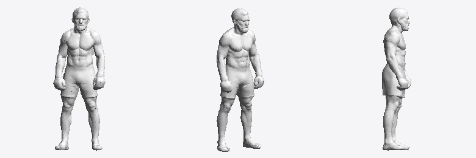
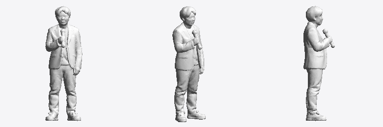
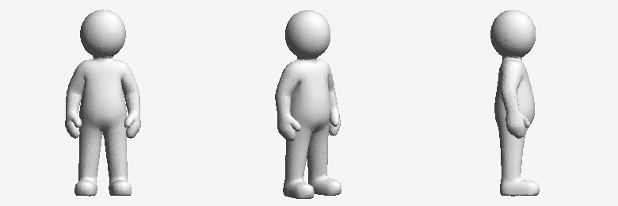
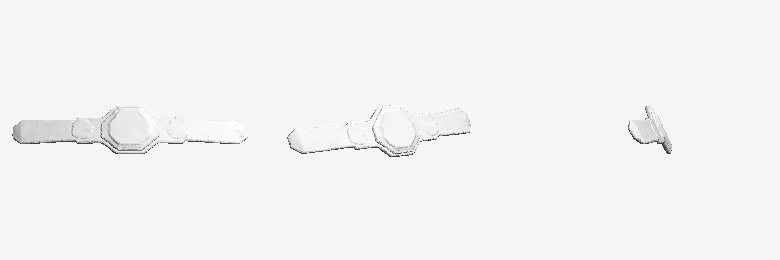
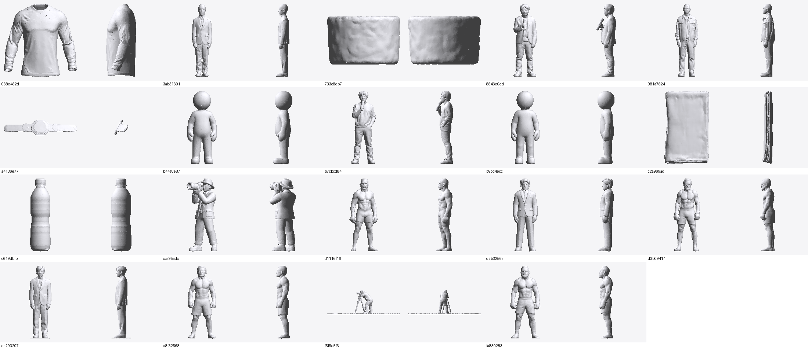

# Каталог 3D-моделей

19 уникальных мешей, распакованных из загруженных ZIP-архивов. Имена файлов —
осмысленные; исходный UUID сохранён, чтобы можно было сопоставить с оригинальной
загрузкой.

Все меши имеют **ровно 40 000 треугольников** и нормализованы каждый в свой
куб 2×2×2 — это характерный признак вывода AI-генератора image-to-3D
(один бюджет полигонов на все модели). Формат — бинарный STL.

**Важно:** нормализация выполнена для каждой модели отдельно, поэтому реальные
пропорции между объектами потеряны — бутылка воды в исходнике ровно такого же
размера, как боец. Множители для восстановления масштаба лежат в
[`assets/scales.json`](assets/scales.json).

## Бойцы (4)

Мускулистые мужские фигуры в шортах и ММА-перчатках, стойка близка к A-позе.

| Файл | Исходный UUID |
|---|---|
| `fighter_bearded_a` | `d1116f16-4117-4029-a161-789ed4448d58` |
| `fighter_gloves_b` | `d3b09414-f801-4bd4-9c02-6d669f80ffd2` |
| `fighter_lean_c` | `e8f32568-fd4d-42c7-a0b7-927dab86dbc3` |
| `fighter_bearded_d` | `fa830283-0a0a-4560-a1fb-9fc445dfaceb` |



## NPC-окружение (8)

| Файл | Что это | Исходный UUID |
|---|---|---|
| `npc_suit_bald_a` | мужчина в костюме | `3ab31601-dcc7-4a5e-a5f3-a31063ec9afb` |
| `npc_suit_haired_b` | мужчина в костюме | `d2b3256a-3eaa-4fef-b351-b72782b1b449` |
| `npc_suit_c` | мужчина в костюме | `da293207-be5b-4f5c-9e09-bcd20efe5809` |
| `npc_official_jacket` | человек в куртке (рефери/официал) | `981a7824-b11d-47f5-a221-ed80e39356e4` |
| `npc_commentator_mic` | комментатор с микрофоном, в костюме | `8846e0dd-64ab-4980-bbea-a99a7bbe5bef` |
| `npc_interviewer_tracksuit` | интервьюер с микрофоном, в спортивном | `b7cbcd84-4ba4-45fe-b964-d6f182fdf8b0` |
| `npc_cameraman_handheld` | оператор с камерой на плече | `cca95adc-32e9-4850-a5b2-65106d8a4ed3` |
| `npc_cameraman_tripod` | оператор со штативом | `f5f5e5f6-abe8-4e80-9211-4487edc82f1a` |



> `npc_cameraman_tripod` содержит запечённую в меш плоскость земли и лежит
> в другой ориентации — плоскость надо удалить, а модель довернуть.

## Болванки (2)

Упрощённые фигуры с шарообразной головой без черт лица. Полезны как заглушки
и как быстрый тест ригов и анимаций.

| Файл | Исходный UUID |
|---|---|
| `mannequin_base_a` | `b44a8e87-4ab9-43fe-af9e-1a5d48fac7b0` |
| `mannequin_base_b` | `b9cd4ecc-7cfe-482e-ad42-f33b58f783aa` |



## Пропсы и одежда (5)

| Файл | Что это | Реальный размер | Исходный UUID |
|---|---|---|---|
| `prop_championship_belt` | чемпионский пояс | 1.30 м в длину | `a4186e77-82f1-46e0-bb02-f3603415d442` |
| `prop_water_bottle` | бутылка воды | 0.24 м | `c619dbfb-964e-4ee6-a8f3-5b7f4ad01db7` |
| `prop_folded_towel` | сложенное полотенце | 0.40 м | `c2a969ad-ac94-4824-96bf-224891d8c7a5` |
| `prop_round_tub` | круглая ёмкость / таз | 0.50 м диаметр | `733c8db7-a972-474b-9125-35c5ec866c57` |
| `apparel_rashguard_longsleeve` | рашгард с длинным рукавом | 0.70 м | `068e482d-5c4f-422f-9328-7b80dd1289ee` |



## Общий контактный лист



## Чего не хватает

- **Ринг/клетка** — ты сказал, что модель не влезла в репозиторий и лежит на
  Google Drive. Из этого окружения `drive.google.com` заблокирован сетевой
  политикой, поэтому забрать её я не могу. Варианты: положить в репозиторий
  через Git LFS, разбить архив на части, или залить на хостинг, который не
  блокируется.
- **Текстуры** — ни в одном из архивов их нет. STL физически не умеет хранить
  ни UV, ни материалы, ни текстуры (см. [docs/ANIMATION.md](docs/ANIMATION.md)).

## Сборка в GLB

```bash
pip install numpy
python3 tools/stl_to_glb.py --scales     # -> build/glb/*.glb, ~0.96 МБ на модель
```

Конвертер сваривает вершины (120 000 → ~20 000), считает сглаженные нормали,
переводит из Z-up в Y-up и ставит модель ступнями в начало координат.
`build/` не коммитится — это ~18 МБ производных данных.
