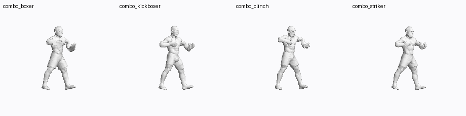
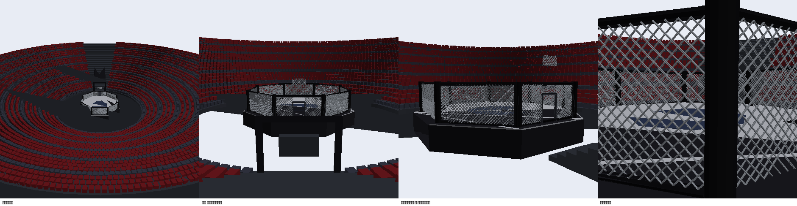
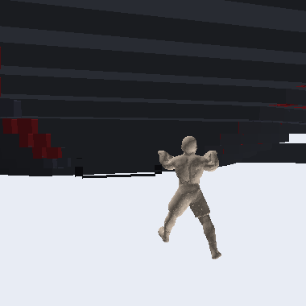
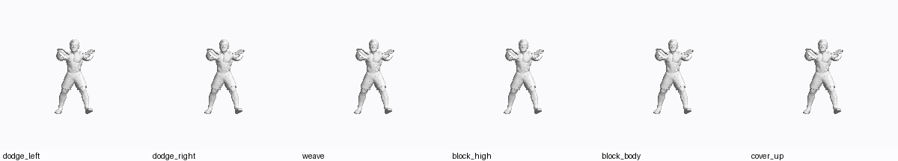
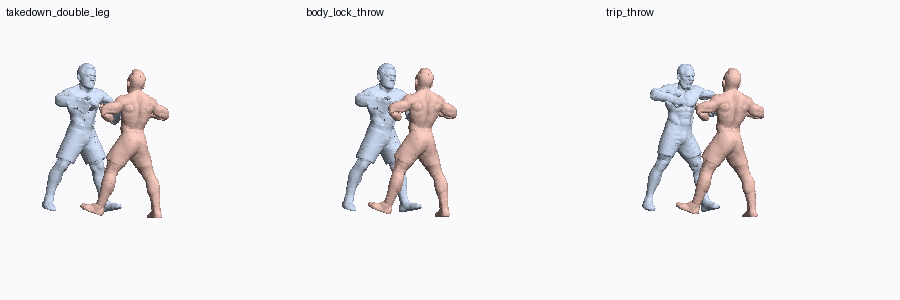
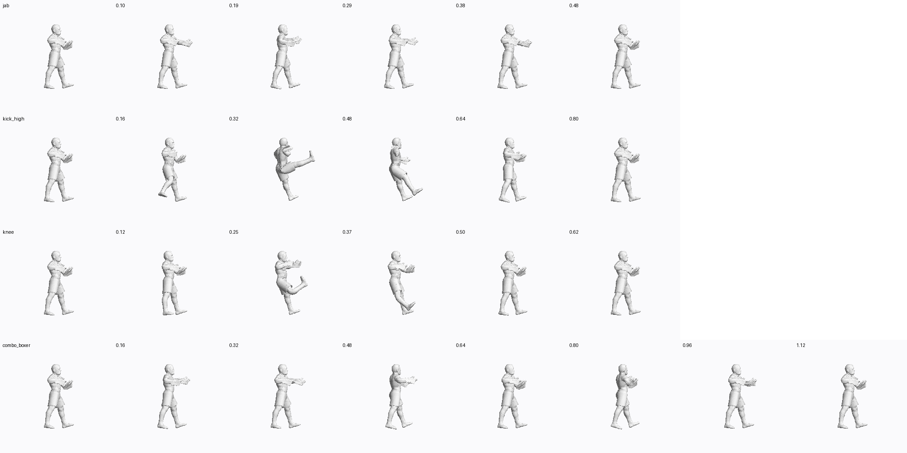

# friendly-octo-broccoli

Ассеты и пайплайн для игры про ММА/бокс.

## Статус

Четыре бойца отригованы и анимированы. У каждого **34–36 клипов, из них
22–24 атаки**: свой набор ударов, броски с настоящим захватом соперника,
уходы в стороны, три вида блока, реакции, нокдаун, подъём и три комбинации,
включая добивание сверху после броска. Всё считается автоматически из самих
мешей — ни один сустав и ни одна поза не выставлены вручную в 3D-редакторе.

`python3 tools/validate.py` проверяет каждый клип на NaN, провал сквозь мат и
на рывки между кадрами.



```
assets/
  fighters/    4 бойца в A-позе: OBJ с UV + текстура + карта metallic/roughness
  models/      19 ранних STL (без UV и текстур), по 40 000 треугольников
  previews/    рендеры: каталог, сегментация, риг, анимации
  scales.json  множители масштаба для STL-моделей
tools/
  build_arena.py      генератор арены: восьмиугольник, сетка, трибуны, тоннель
  meshkit.py          процедурные примитивы и запись GLB
  import_textured.py  импорт OBJ с UV и PBR-картами, ужатие текстур
  segment.py          разделение фигуры на голову / руки / ноги / торс
  autorig.py          скелет из 19 костей + скиннинг -> GLB
  animate.py          клипы ударов и комбо -> glTF-анимации в GLB
  stl_to_glb.py       конвертер ранних STL в GLB и OBJ
docs/
  ANIMATION.md        как устроен пайплайн и что осталось
CATALOG.md            каталог всех моделей с превью
```

## Быстрый старт

```bash
pip install numpy scipy pillow
python3 tools/autorig.py     # assets/fighters -> build/rigged/*.glb  (скелет + скиннинг)
python3 tools/animate.py     # build/rigged   -> build/animated/*.glb (34-36 клипов)
python3 tools/validate.py    # проверка всех клипов
python3 tools/animate.py --list
```

На выходе — обычные GLB с glTF-анимациями. В three.js подключаются напрямую
через `AnimationMixer`, никакого рантайм-кода для рига не нужно.

## Арена

Генерируется кодом, а не моделируется, поэтому размеры настоящие и остаются
правкой в одну строку: восьмиугольник 9.14 м от стенки до стенки, сетка 1.83 м,
помост поднят на 1.22 м.

```bash
python3 tools/build_arena.py            # -> build/arena/arena.glb  (~78k треугольников)
python3 tools/build_arena.py --no-seats # без зрительских кресел, заметно легче
```

**Сетка — настоящая геометрия**, диагональные прутки, сплетённые в ромбы, а не
текстура с дырками. Клетку видно с нескольких метров через движущуюся камеру, и
плоскость с альфа-каналом выдаёт себя в первый же момент, когда меняется ракурс.

Есть калитка с рамой, лестница на помост, тоннель для выхода и чаша трибун на
24 ряда с креслами — их и будем заселять зрителями.



## Выход бойца

Цикл шага задан **на месте**: стопы уезжают назад под неподвижным телом.
Если запечь продвижение вперёд в зацикленный клип, боец будет телепортироваться
в начало тоннеля на каждом круге — вперёд его двигает сцена, а не анимация.



## Бойцы и приёмы

По **27 клипов** на бойца, из них 15 атак. Имена бойцов — идентификаторы
ассетов, а не бренд.

| Ключ | Боец | Стойка | Чем отличается |
|---|---|---|---|
| `fighter_apose_01` | khabib | ортодокс | борьба: проходы в ноги, обхват, добивание сверху |
| `fighter_apose_02` | jones | ортодокс | длинная дистанция: боковой в колено, вертушки, локти |
| `fighter_apose_03` | islam | ортодокс | ударка плюс перевод: подсечка, обхват, добивание |
| `fighter_apose_04` | conor | **левша** | левый прямой, вертушка с ноги, тип |

Общие для всех: `idle`, `step_in`, `back_step`, `slip`, `weave`,
`dodge_left`, `dodge_right`, `block`, `block_high`, `block_body`, `cover_up`,
`hit_head`, `hit_body`, `knockdown`, `get_up`.



Полный разбор каждой атаки по бойцам — в
[`assets/previews/anim/attacks/`](assets/previews/anim/attacks/).

Ударный пул: `jab`, `cross`, `hook_L/R`, `uppercut_L/R`, `overhand_R`,
`body_hook`, `elbow`, `spinning_elbow`, `spinning_back_kick`, `kick_low`,
`kick_body`, `kick_high`, `front_kick`, `teep`, `oblique_kick`, `side_kick`,
`knee`, `flying_knee`, `superman_punch`, `level_change`, `ground_pound`.

Броски и переводы: `takedown_double_leg`, `takedown_single_leg`,
`body_lock_throw`, `trip_throw` — плюс по две комбинации на бойца.



## Как устроен захват

Бросок — это движение двух тел. Сначала решается тот, кого бросают, потом его
скелет прогоняется через прямую кинематику, и только затем руки атакующего
наводятся на точки захвата, **считанные с этого позированного скелета**.
Захват, заданный фиксированными координатами кистей, выглядит правильно ровно
в одном кадре и соскальзывает во всех остальных.

Атакующий при этом не стоит на месте: его положение и разворот выводятся из
самого захвата, а не задаются вручную. Иначе он не успевает за тем, кого
бросает.

Средний промах захвата — **0.063 роста** (около 12 см при росте 185), причём
на большинстве кадров он нулевой; расходится только самый финал, где руки в
реальности и отпускают.



## Как это работает

**Скелет** ставится по геометрии: конечности находятся farthest-point
сэмплированием по геодезическому расстоянию, осевые линии — обходом
геодезических колец от кончиков, суставы снимаются с этих линий. Ноги и
позвоночник пришпилены к анатомическим высотам, потому что длина стопы
перекашивает отсчёт по дуге и роняет колено слишком низко.

**Скиннинг** — жёсткое назначение ближайшей кости с последующей диффузией по
поверхности меша. Взвешивание по обратному расстоянию на торсе не работает:
он широкий, все кости позвоночника от груди почти равноудалены, вес
размазывается по шести костям, и соседние вершины оставляют разные четвёрки
при обрезке — меш рвётся на плече.

**Анимации** задаются позициями кистей и стоп, а не углами костей; двухзвенный
IK превращает их в повороты плеча и локтя. Задавать углы напрямую невозможно
читать, потому что поворот композируется через уже повёрнутого родителя.

Подробнее — в [docs/ANIMATION.md](docs/ANIMATION.md).

## Известные пробелы

- **Игровой код ещё не написан** — есть арена и анимации, нет боевой логики,
  камеры и HUD.
- Трибуны пустые: сиденья расставлены, зрителей на них пока нет.
- **Пальцы на перчатках не смоделированы**, кулак сжат постоянно. Для ММА это
  нормально; если понадобится раскрытая кисть — это морф-таргет, а не кости.
- Ранние STL в `assets/models/` держат руки прижатыми к торсу и для рига не
  годятся; они оставлены как NPC и пропсы.
- Один из бойцов — узнаваемый портрет реального спортсмена. Для локального
  проекта неважно, для публикации внешность придётся менять.
