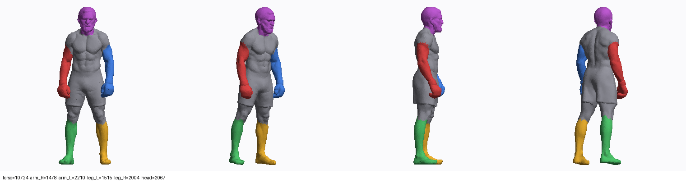

# friendly-octo-broccoli

Библиотека 3D-ассетов для игры про ММА/бокс.

## Статус

Загруженные ZIP-архивы распакованы: **19 уникальных моделей**, разложены по
осмысленным именам в `assets/models/`. Ни одна модель пока не готова к
анимации — подробности ниже.

```
assets/
  models/      19 бинарных STL, по 40 000 треугольников
  previews/    отрендеренные превью (спереди / 3-4 / сбоку)
  scales.json  множители масштаба для приведения к реальным размерам
tools/
  stl_to_glb.py  конвертер STL -> GLB и OBJ (сварка вершин, нормали, Y-up)
  segment.py     авторазделение фигуры на голову/руки/ноги/торс
docs/
  ANIMATION.md   что нужно, чтобы это анимировать
CATALOG.md       каталог моделей с превью
```

## Что в наборе

4 бойца, 8 NPC (комментаторы, интервьюер, операторы, официал, люди в
костюмах), 2 болванки, 4 пропса (пояс, бутылка, полотенце, таз) и рашгард.
Полный список с превью — в [CATALOG.md](CATALOG.md).

## Быстрый старт

```bash
pip install numpy scipy pillow
python3 tools/stl_to_glb.py --scales                 # -> build/glb/*.glb  (движок)
python3 tools/stl_to_glb.py --format obj --scales    # -> build/obj/*.obj  (загрузка в Mixamo)
python3 tools/segment.py                             # -> build/segmentation/ + превью
```

## Про анимацию — коротко

STL хранит только треугольники. В нём **нет и не может быть** ни UV, ни
текстур, ни костей, ни весов скиннинга. Плюс топология AI-генерации без
рёберных петель на суставах плохо деформируется, а одежда и перчатки
сплавлены с телом в один меш.

Чтобы дойти до ударов и комбо, нужно: ретопология → UV и запекание текстур →
риг (быстрый путь — Mixamo) → скиннинг → анимации.

При этом кровь, камеры, боевая логика и HUD от моделей не зависят и делаются
параллельно. Полный разбор — в [docs/ANIMATION.md](docs/ANIMATION.md).

`tools/segment.py` уже умеет разделять фигуру автоматически. Голова, кисти и
голени отделяются на всех моделях; **рука целиком — только у
`fighter_gloves_b`**, потому что у остальных руки висят вплотную и приварены
к торсу. Это главный кандидат в основного бойца.



## Известные пробелы

- **Модель ринга отсутствует** — лежит на Google Drive, а `drive.google.com`
  заблокирован сетевой политикой этого окружения. Нужно положить её в
  репозиторий (Git LFS) или на доступный хостинг.
- **Текстур нет ни в одном архиве.** Если генератор отдавал также GLB/FBX/OBJ —
  залей их, там уже есть UV и текстуры.
- `npc_cameraman_tripod` содержит запечённую плоскость земли и повёрнут иначе,
  чем остальные.
- Каждая модель нормализована независимо, поэтому исходные пропорции между
  объектами потеряны; восстанавливаются через `assets/scales.json`.
